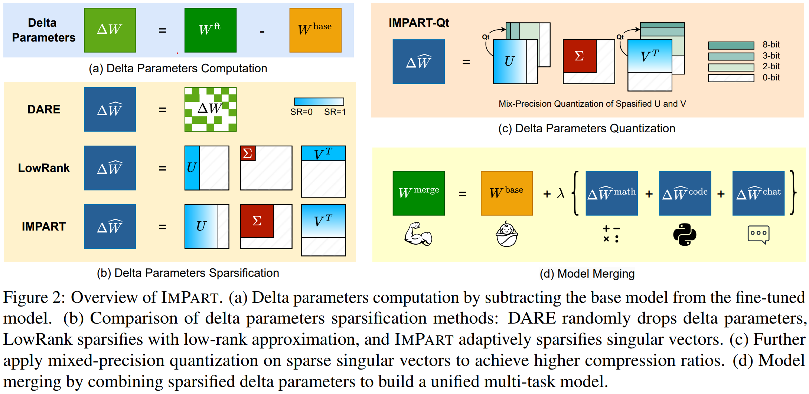
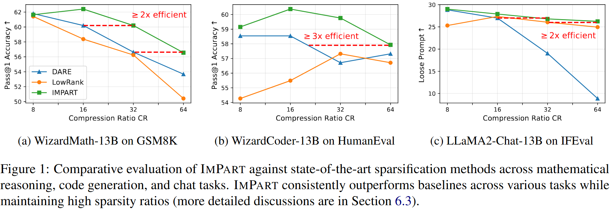
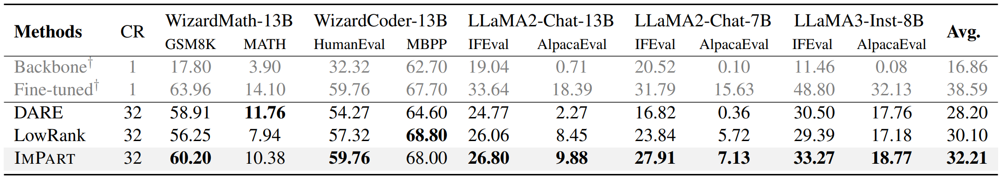
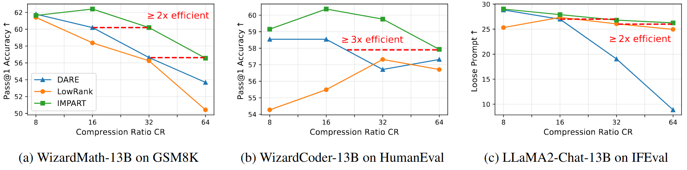
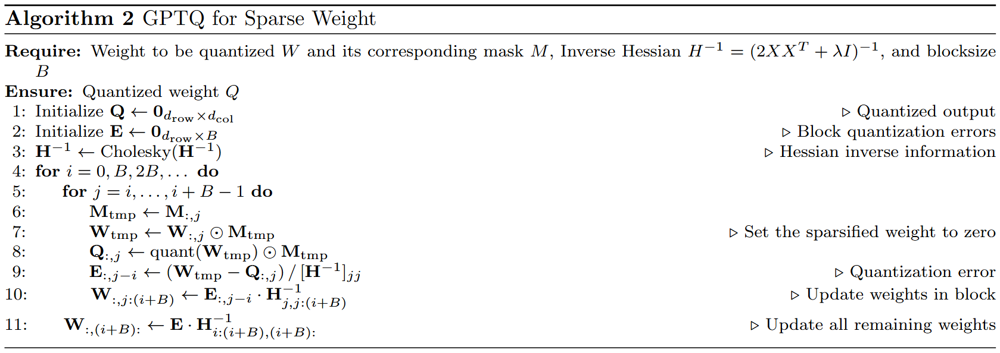
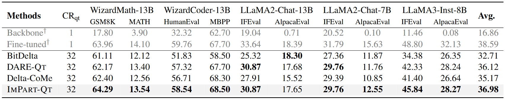
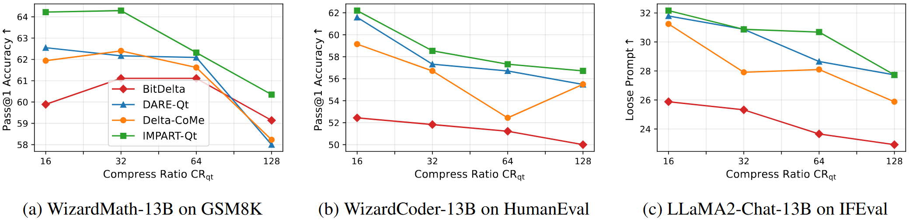
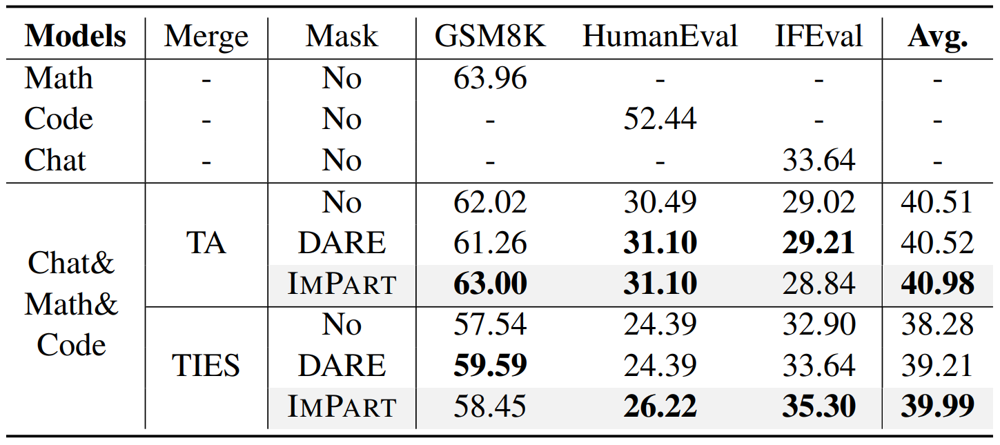

# [[ACL 2025] <span style="font-variant: small-caps;">ImPart</span>: Importance-Aware Delta-Sparsification for Improved Model Compression and Merging in LLMs](https://arxiv.org/abs/2504.13237)

The official repository containing the introduction and code for our ACL 2025 paper: [<span style="font-variant: small-caps;">ImPart</span>: Importance-Aware Delta-Sparsification for Improved Model Compression and Merging in LLMs](https://arxiv.org/abs/2504.13237).

[//]: # (<p align="center">|)

[//]: # (  <a href="#-news"> 🔥 News</a> |)

[//]: # (  <a href="#-motivation">💡 Motivation</a> |)

[//]: # (  <a href="#-seqar">🔖 <span style="font-variant: small-caps;">ImPart</span></a> |)

[//]: # (</p>)

[//]: # ()
[//]: # (<p align="center">|)

[//]: # (  <a href="#️-quick-start"> ⚡️ Quick Start </a> |)

[//]: # (  <a href="#-citation">📓 Citation</a> | )

[//]: # (  <a href="https://arxiv.org/abs/2407.01902">📃 Paper </a>|)

[//]: # (</p>)

# 🔥 News
- **May 2025**: Our paper has been accepted by **ACL 2025 main conference**.
- **Apr 2025**: We released our paper on [**arxiv**](https://arxiv.org/abs/2504.13237).

# 🔖 <span style="font-variant: small-caps;">ImPart</span>: Overview
### <span style="font-variant: small-caps;">ImPart</span>: **Imp**ortance-**A**ware Delta-Spa**r**sifica**t**ion
- Motivated by the observation that singular vectors with larger singular values encode more important task-specific information.
- <span style="font-variant: small-caps;">ImPart</span> assigns variable sparsity ratios to singular vectors based on their corresponding singular values.

<span id="ImPart"></span>


### <span style="font-variant: small-caps;">ImPart</span>'s Performance across multiple compression ratio

<span id="ImPart"></span>



# ⚡️ Quick Start
## Requirments
Install all the packages from **requirments.txt**
```shell
conda create -n impart python=3.10 -y
conda activate impart
git clone https://github.com/sustech-nlp/ImPart.git
cd ImPart
pip install -r requirements.txt
```

## Models & Benchmark
| **Task** | **Fine-tuned**                                                                   | B**ackbone**                                                        | **Benchmark**                                           | **Benchmark**                                          |
|------|------------------------------------------------------------------------------|-----------------------------------------------------------------|---------------------------------------------------------|--------------------------------------------------------|
| **Math** | [WizardMath-13B-V1.0](https://huggingface.co/vanillaOVO/WizardMath-13B-V1.0) | [LLaMA-2-13B](https://huggingface.co/meta-llama/Llama-2-13b-hf) | [GSM8K](https://huggingface.co/datasets/openai/gsm8k)   | [MATH](https://github.com/hendrycks/math/)             |
| **Code** | [WizardCoder-13B]()                                                          | [CodeLlama-13B](codellama/CodeLlama-13b-hf)                     | [HumanEval](https://github.com/openai/human-eval)                                           | [MBPP](https://github.com/google-research/google-research/blob/master/mbpp)                                               | 
| **Chat** | [LLaMA-2-13B-Chat]()                                                         | [LLaMA-2-13B](https://huggingface.co/meta-llama/Llama-2-13b-hf) | [IFEval](https://huggingface.co/datasets/google/IFEval) | [AlpacaEval](https://github.com/tatsu-lab/alpaca_eval) |
| **Chat** | [LLaMA-2-7B-Chat]()                                                          | [LLaMA-2-7B](https://huggingface.co/meta-llama/Llama-2-13b-hf)  | [IFEval](https://huggingface.co/datasets/google/IFEval) | [AlpacaEval](https://github.com/tatsu-lab/alpaca_eval) |
| **Chat** | [LLaMA-3-8B-Instruct]()                                                      | [LLaMA-3-8B](https://huggingface.co/meta-llama/Llama-2-13b-hf)  | [IFEval](https://huggingface.co/datasets/google/IFEval) | [AlpacaEval](https://github.com/tatsu-lab/alpaca_eval) |


## SVD $\Delta W$
- Compute svd of $\Delta$ weight between base model and finetuned model.
```shell
python delta.py \
  --svd \
  --base_model "meta-llama/Llama-2-13b-hf" \
  --finetuned_model "vanillaOVO/WizardMath-13B-V1.0" \
  --dim 5120 \
  --save_path "delta_weight_save_path.pt"
```
---

## <span style="font-variant: small-caps;">ImPart</span>
### Run Sparsification
```shell
python sparsify/sparsify.py \
  --config sparsify/config_example.yaml
```

### Sparsification Performance

- <span style="font-variant: small-caps;">**ImPart**</span> outperforms baselines across most tasks and backbones, achieving the highest average score.


- <span style="font-variant: small-caps;">**ImPart**</span> achieves more than $2 \times$ higher compression efficiency across 8 to 64 compression ratios.
---


## Evaluation
- Following the implemention in DARE and Delta-CoMe
### Math Reasoning
```shell
# GSM8K
bash eval/scripts/gsm8k.sh "fine-tuned model name or path" "fp16"
# MATH
bash eval/scripts/math.sh "fine-tuned model name or path" "fp16"
```

### Code Generation
```shell

```

### Instruction Following
```shell

```

---

## <span style="font-variant: small-caps;">ImPart</span> + Quantization
- Following Delta-CoMe, <span style="font-variant: small-caps;">ImPart-Qt</span> applies 8-3-2 bits mix precision quantization to $\Delta W$'s sparse singular vector, detailed in Section 7.1 and Appendix B.1.
- Extend GPTQ to accommodate sparse weight matrix as the following algorithm (Algorithm 2 in paper).

- The code is modified based on the implementation of [Delta-CoMe](https://github.com/thunlp/Delta-CoMe).


### Run Quantization
- Get $\Delta W$'s sparse singular vector for quantization. Ensure the total compression ratio match the target.
```shell
python sparsify/sparsify_quant.py \
  --config sparsify/config_example.yaml
```
- Quantize the $\Delta W$
```shell
python quantize/sparse_llama.py \
  "fine-tuned model name or path" \
  "c4" \
  --config "quantize/13b_config_example.yaml" \
  --saved_delta_path "saving path of sparse delta weight" \
  --save_compressed_delta_dir "path to save the quantized delta weight"
```
- Reload quantized $\Delta W$ to pretrained model
```shell
python delta.py \
  --merge \
  --finetuned_model "fine-tuned model name or path" \
  --delta_path "path to save the quantized delta weight" \
  --save_path "path to save the reconstructed model"
```

### Quantization Performance

- <span style="font-variant: small-caps;">**ImPart-Qt**</span> achieves **nearly lossless performance** in the **Compression Ratio (CR) of 32**.



---

## <span style="font-variant: small-caps;">ImPart</span> + Model Merging
- The $\Delta W$ processed by <span style="font-variant: small-caps;">ImPart</span> can be used to improve the performance of model merging.
- Following [DARE](https://arxiv.org/abs/2311.03099), we apply <span style="font-variant: small-caps;">ImPart</span> to two classic model merging method: [Task Arithmetic](https://arxiv.org/abs/2212.04089) and [TIES-Merging](https://arxiv.org/abs/2306.01708)

### Run Model Merging
- Task Arithmetic: use "merge_method" like "ta_n", where n is the scaling term.
- TIES-Merging: use "merge_method" like "ties_t_n", where t is the trim ratio and n is the scaling term.
```shell
python merge/merge.py \
    --merge_method "ta_0.5" \ 
    --ptm_pth "pretrained model for math" \
    --math_pth "ImPart-processed fine-tuned model for math" \
    --code_pth "ImPart-processed fine-tuned model for code" \
    --chat_pth "ImPart-processed fine-tuned model for chat" \
    --save_pth "dir to save the merged model"
```

### Merging Performance


---

# 📓 Citation
If you find this repo useful for your research, please cite us as:
```bibtex
@misc{yang2025impart,
      title={ImPart: Importance-Aware Delta-Sparsification for Improved Model Compression and Merging in LLMs}, 
      author={Yan Yang and Yixia Li and Hongru Wang and Xuetao Wei and James Jianqiao Yu and Yun Chen and Guanhua Chen},
      year={2025},
      eprint={2504.13237},
      archivePrefix={arXiv},
      primaryClass={cs.CL},
      url={https://arxiv.org/abs/2504.13237}, 
}
```